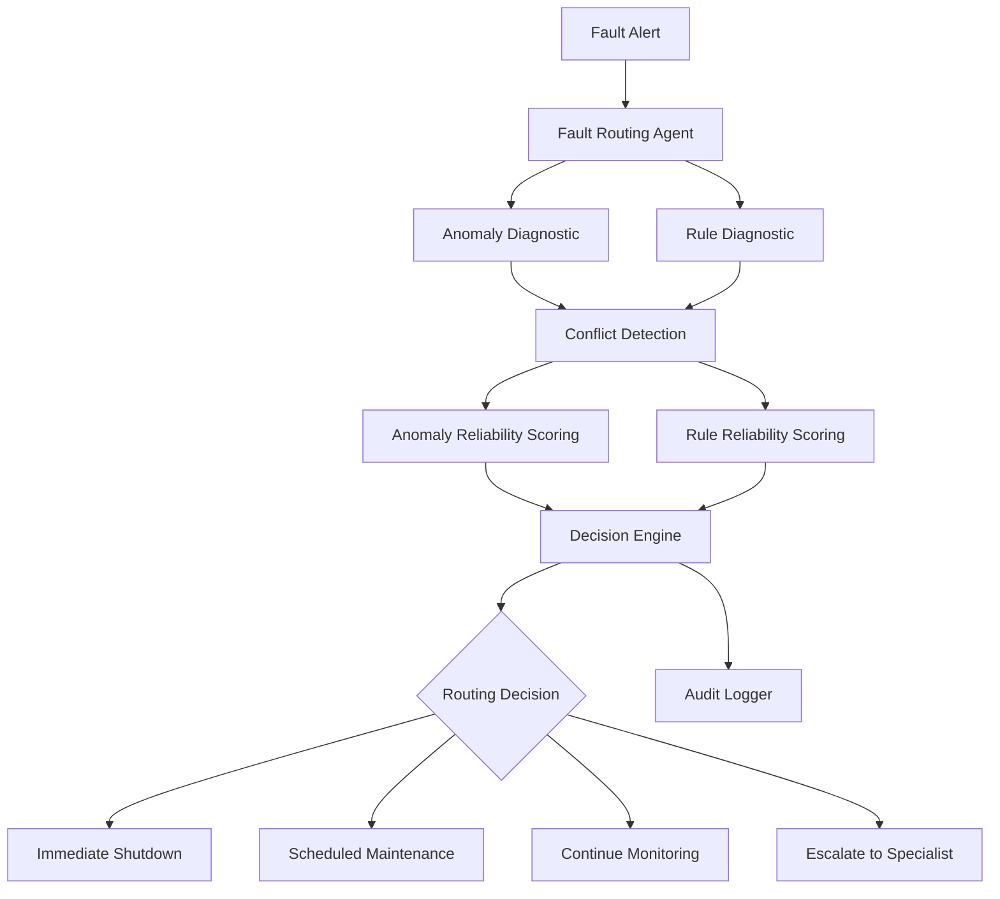

# Industrial Fault Routing Agent

An auditable decision agent for resolving conflicting industrial equipment diagnostics.

The system receives competing assessments from:

* an **ML anomaly detector**, which is sensitive to novel failure patterns but vulnerable to false positives and noisy sensor behaviour;
* a **rule-based diagnostic engine**, which is precise for known faults but brittle when encountering novel conditions or stale rule updates.

For each fault, the agent evaluates the reliability of both sources, identifies their specific disagreement, selects an operational action, and produces an auditable explanation of the decision.

## Supported Actions

The agent routes each alert to one of four outcomes:

* **Immediate shutdown**
* **Scheduled maintenance**
* **Continue monitoring**
* **Escalate to specialist**

The decision policy deliberately does not always trust either diagnostic source.

---

## Demo

Run the interactive dashboard:

```bash
streamlit run dashboard.py
```

The dashboard provides three views:

1. **Fault Routing** — compare both diagnostic systems and process individual alerts.
2. **Out-of-Sequence Rule Update** — demonstrate stale rule-version detection.
3. **Audit Log** — inspect previously processed decisions.

---

## Architecture



The core routing logic is deterministic rather than LLM-based so that safety-related decisions remain reproducible, inspectable, and easy for a human operator to challenge.

---

## Decision Policy

Each diagnostic source receives a context-dependent reliability score.

### Anomaly detector

The anomaly detector begins with its model confidence.

Its reliability is then adjusted using:

| Criterion                      | Effect                                                   |
| ------------------------------ | -------------------------------------------------------- |
| High model confidence          | Supports anomaly diagnosis                               |
| Stable confidence history      | Supports anomaly reliability                             |
| Oscillating confidence history | Significant reliability penalty                          |
| Previous similar failures      | Reliability bonus                                        |
| High equipment criticality     | Increases the consequence of ignoring credible anomalies |

A population standard deviation above `0.20` across recent confidence values is treated as unstable sensor behaviour.

### Rule engine

The rule engine begins with a baseline reliability score.

Its reliability is adjusted using:

| Criterion              | Effect                                   |
| ---------------------- | ---------------------------------------- |
| Known fault-code match | Reliability bonus                        |
| No matching fault rule | Reliability penalty                      |
| Current rule version   | Reliability bonus                        |
| Stale rule version     | Verdict excluded from decision authority |

A stale rule is assigned a reliability of `0.0` rather than merely receiving a small penalty because evidence known to be obsolete should not override a current diagnostic.

### Uncertainty handling

The system also avoids forcing a winner.

If the strongest diagnostic has reliability below `0.60`, the alert is escalated.

If the difference between the diagnostic scores is less than `0.15`, the evidence is treated as too close to safely distinguish and the alert is escalated to a specialist.

This explicitly represents uncertainty instead of manufacturing confidence from a small numerical difference.

---

## Required Failure Modes

### 1. Noisy / oscillating anomaly confidence

An anomaly detector may currently report high confidence even when its recent predictions have behaved like:

```text
0.91 → 0.32 → 0.87 → 0.29 → 0.91
```

The agent measures confidence stability across recent predictions.

Large oscillation reduces anomaly-detector reliability, allowing a well-supported rule-engine verdict to win instead.

This behaviour is demonstrated by sample fault `F002`.

### 2. Out-of-sequence rule updates

Rule-engine updates may arrive in network order rather than version order.

For example:

```text
Rule version 12 arrives
        ↓
Rule version 10 arrives later
```

The agent tracks the latest observed rule version for each equipment/fault-code pair.

Version `10` is therefore recognised as stale and is prevented from overriding version `12`.

The dashboard contains a dedicated **Out-of-Sequence Rule Update** demonstration for this scenario.

---

## Example Decisions

### F001 — Critical bearing anomaly

* Anomaly confidence: `0.94`
* Confidence history: stable
* Equipment criticality: high
* Previous similar failures: 2
* Rule recommendation: continue monitoring

Result:

```text
Winner: Anomaly Detector
Action: Immediate Shutdown
```

### F002 — Noisy sensor behaviour

* Current anomaly confidence: `0.91`
* Confidence history: highly unstable
* Known rule match: startup vibration

Result:

```text
Winner: Rule Engine
Action: Continue Monitoring
```

### F003 — Ambiguous evidence

* Anomaly reliability: approximately `0.79`
* Rule reliability: approximately `0.80`

The difference is below the configured winning margin.

Result:

```text
Winner: Neither
Action: Escalate to Specialist
```

### F006 — Known maintenance condition

A weak anomaly competes against a recognised lubrication rule.

Result:

```text
Winner: Rule Engine
Action: Scheduled Maintenance
```

---

## Auditability

Every processed fault is appended to:

```text
logs/decisions.jsonl
```

Each record contains:

* equipment metadata;
* both diagnostic inputs;
* detected conflicts;
* anomaly and rule reliability scores;
* decision criteria applied;
* stale-rule status;
* winning diagnostic;
* final operational action;
* human-readable reasoning.

The JSONL format provides an append-only, machine-readable decision history that can be reviewed by an operator or consumed by downstream monitoring systems.

Generated runtime logs are intentionally excluded from Git.

---

## Project Structure

```text
industrial-fault-routing-agent/
│
├── app.py
├── dashboard.py
├── requirements.txt
├── README.md
│
├── src/
│   ├── __init__.py
│   ├── models.py
│   ├── agent.py
│   ├── decision_engine.py
│   └── audit_logger.py
│
├── data/
│   ├── sample_faults.json
│   └── rule_update_scenario.json
│
├── logs/
│   └── .gitkeep
│
└── tests/
    └── test_decision_engine.py
```

---

## Running Locally

### 1. Clone the repository

```bash
git clone https://github.com/vaishali483/industrial-fault-routing-agent.git
cd industrial-fault-routing-agent
```

### 2. Create a virtual environment

```bash
python -m venv .venv
```

Windows PowerShell:

```powershell
.venv\Scripts\Activate.ps1
```

macOS/Linux:

```bash
source .venv/bin/activate
```

### 3. Install dependencies

```bash
pip install -r requirements.txt
```

### 4. Run the CLI demonstration

```bash
python app.py
```

### 5. Run the interactive dashboard

```bash
streamlit run dashboard.py
```

---

## Tests

Run:

```bash
python -m pytest -v
```

The test suite covers:

* high-confidence critical anomaly → shutdown;
* noisy anomaly confidence → rule engine wins;
* ambiguous reliability → specialist escalation;
* known maintenance rule → scheduled maintenance;
* stale/out-of-sequence rule update detection;
* missing rule coverage for novel faults;
* low-confidence evidence → no forced winner.

Current suite:

```text
7 passed
```

---

## Design Choices

### Deterministic core decision logic

I intentionally kept the operational decision deterministic rather than delegating routing to an LLM.

For industrial fault handling, the same evidence should produce the same outcome, and every threshold should be visible and challengeable by an operator.

An LLM could be added later for operator-facing explanation or investigation assistance without making it the authority for safety-critical routing.

### Stale rules are invalid evidence

Once the agent knows that a rule verdict is older than a previously observed version, it receives zero decision authority.

This prevents network ordering issues from silently rolling equipment back to an obsolete diagnostic recommendation.

### Escalation is a valid outcome

The system does not assume that one source must always win.

When neither diagnostic is sufficiently trustworthy, or their reliability scores are too close, the safe decision is to request specialist review.

---

## Assumptions and Limitations

This project models the **routing layer between diagnostic systems** rather than implementing the anomaly model or industrial rule engine themselves.

The diagnostics are supplied through structured sample alerts.

The reliability weights and thresholds are deliberately explicit engineering policy values for this assessment; in a production system they should be calibrated using historical fault outcomes, false-positive/false-negative costs, equipment-specific risk models, and operator feedback.

Rule-version state is currently maintained in process memory. A production deployment would persist version state in a transactional datastore so that stale-update protection survives restarts and works across multiple agent instances.

---

## What I Would Do Next

With more time I would:

1. Calibrate reliability scores against labelled historical fault outcomes rather than hand-selected policy weights.
2. Persist rule-version state and audit logs in a database.
3. Introduce equipment-specific risk profiles and false-negative cost models.
4. Add schema validation for malformed or incomplete diagnostic messages.
5. Add concurrent-event and duplicate-message handling.
6. Add operator acknowledgement and decision-override workflows.
7. Track the eventual fault outcome so the system can measure which diagnostic source was correct over time.
8. Add observability metrics for escalation rate, false shutdowns, stale updates, and diagnostic agreement.
9. Add an optional LLM layer for natural-language operator summaries while keeping the routing policy deterministic.

---

## Tech Stack

* Python 3.12
* Streamlit
* pytest
* Python standard-library dataclasses, enums, statistics, JSON, and logging utilities
