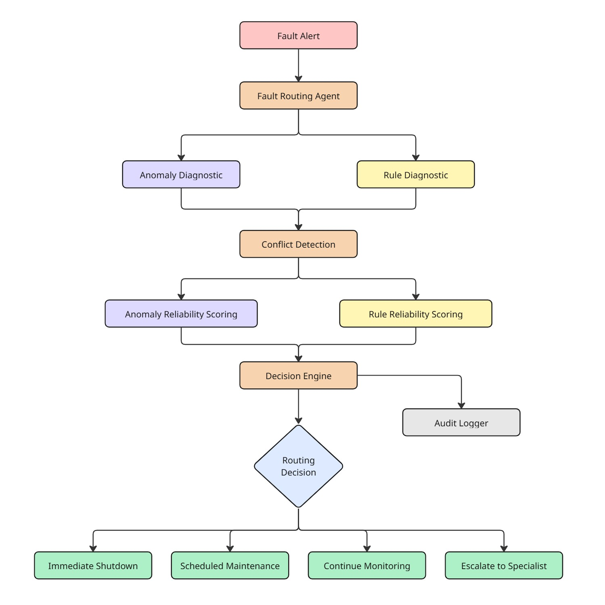

# Industrial Fault Routing Agent

An auditable agent that handles conflicting diagnostics from industrial equipment.

The system receives results from two sources:

* **ML Anomaly Detector:** Good at finding unusual or new failure patterns, but can be affected by sensor noise and false positives.
* **Rule-based Diagnostic Engine:** Reliable for known faults, but can miss new failure patterns or use outdated rule updates.

For each fault, the agent compares both results, checks how reliable they are, finds the conflict, and chooses the safest action. It also records why that decision was made.

### Supported Actions

Each fault is routed to one of four actions:

* **Immediate shutdown**
* **Scheduled maintenance**
* **Continue monitoring**
* **Escalate to specialist**

The agent does not always trust one diagnostic source over the other.

---

## Demo

Run the interactive dashboard:

```bash
streamlit run dashboard.py
```

The dashboard has three views:

1. **Fault Routing:** Process individual fault alerts and compare both diagnostic systems.
2. **Out-of-Sequence Rule Update:** Show how stale rule updates are detected.
3. **Audit Log:** View past decisions and their results.

---

## Architecture

<p align="center">

</p>

The main routing logic is deterministic instead of LLM-based. This keeps the decisions repeatable, easy to inspect, and easier for an operator to question.

---

## Decision Policy

Each diagnostic source gets a reliability score based on the current fault.

### Anomaly Detector

The anomaly detector starts with its confidence score.

| Criteria                       | Effect                            |
| ------------------------------ | --------------------------------- |
| High model confidence          | Supports the anomaly result       |
| Stable confidence history      | Increases trust                   |
| Oscillating confidence history | Reduces trust                     |
| Previous similar failures      | Adds a reliability bonus          |
| High equipment criticality     | Makes missed failures more costly |

If the standard deviation of recent confidence values is above `0.20`, the signal is treated as unstable.

### Rule Engine

The rule engine starts with a base reliability score.

| Criteria               | Effect                     |
| ---------------------- | -------------------------- |
| Known fault-code match | Increases trust            |
| No matching fault rule | Reduces trust              |
| Current rule version   | Increases trust            |
| Stale rule version     | Removes decision authority |

A stale rule gets a reliability score of `0.0`. If we already know the rule is outdated, it should not be able to override a newer diagnosis.

### Uncertainty Handling

The agent does not force a winner.

If the highest reliability score is below `0.60`, the fault is escalated.

If the difference between both scores is less than `0.15`, the evidence is too close to make a safe choice. The fault is then sent to a specialist.

---

## Required Failure Modes

### 1. Noisy Anomaly Confidence

The anomaly detector may show high confidence even when recent readings are unstable.

For example:

```text
0.91 → 0.32 → 0.87 → 0.29 → 0.91
```

The agent checks the recent confidence history. If the values change too much, trust in the anomaly detector is reduced.

This can be seen in sample fault `F002`.

### 2. Out-of-Sequence Rule Updates

Rule updates may arrive in the wrong order.

For example:

```text
Rule version 12 arrives
        ↓
Rule version 10 arrives later
```

The agent keeps track of the latest rule version seen for each equipment and fault-code pair.

Since version `10` is older than version `12`, it is marked as stale and cannot override the newer result.

This can also be tested from the **Out-of-Sequence Rule Update** page in the dashboard.

---

## Example Decisions

### F001: Critical Bearing Anomaly

* Anomaly confidence: `0.94`
* Confidence history: stable
* Equipment criticality: high
* Previous similar failures: 2
* Rule recommendation: continue monitoring

```text
Winner: Anomaly Detector
Action: Immediate Shutdown
```

### F002: Noisy Sensor Behaviour

* Current anomaly confidence: `0.91`
* Confidence history: unstable
* Known rule match: startup vibration

```text
Winner: Rule Engine
Action: Continue Monitoring
```

### F003: Unclear Evidence

* Anomaly reliability: about `0.79`
* Rule reliability: about `0.80`

The scores are too close to safely choose one source.

```text
Winner: Neither
Action: Escalate to Specialist
```

### F006: Known Maintenance Condition

A weak anomaly is compared with a known lubrication rule.

```text
Winner: Rule Engine
Action: Scheduled Maintenance
```

---

## Audit Logs

Every processed fault is saved to:

```text
logs/decisions.jsonl
```

Each record includes:

* equipment details
* both diagnostic results
* detected conflicts
* reliability scores
* criteria used
* stale-rule status
* winning diagnostic
* final action
* decision reasoning

This makes each decision easy to review later.

---

## Project Structure

```text
Industrial_Fault_Routing_Agent/
│
├── app.py
├── dashboard.py
├── requirements.txt
├── README.md
│
├── src/
│   ├── __init__.py
│   ├── models.py
│   ├── agent.py
│   ├── decision_engine.py
│   └── audit_logger.py
│
├── data/
│   ├── sample_faults.json
│   └── rule_update_scenario.json
│
├── logs/
│   └── .gitkeep
│
└── tests/
    └── test_decision_engine.py
```

---

## Running Locally

1. Clone the repository:

```bash
git clone https://github.com/vaishali483/Industrial_Fault_Routing_Agent.git
cd Industrial_Fault_Routing_Agent
```

2. Create a virtual environment:

```bash
python -m venv .venv
```

3. Activate it and install the dependencies:

```bash
pip install -r requirements.txt
```

4. Run the CLI demo:

```bash
python app.py
```

5. Run the dashboard:

```bash
streamlit run dashboard.py
```

### Tests

Run:

```bash
python -m pytest -v
```

The tests cover:

* critical anomaly leading to shutdown
* noisy anomaly confidence
* specialist escalation when scores are too close
* scheduled maintenance
* stale rule updates
* novel faults with no matching rule
* low-confidence evidence

---

## Design Choices

#### Deterministic Decision Logic:

I kept the main routing logic deterministic instead of using an LLM. For this type of system, the same input should give the same result. The thresholds and rules should also be easy for an operator to inspect. An LLM could still be added later to help explain decisions in natural language, without letting it control the final routing action.

#### Stale Rules Are Not Trusted:

If an older rule version arrives after a newer one, the agent marks it as stale and gives it a reliability score of `0.0`. This prevents an outdated rule from replacing a newer diagnosis.

#### Escalation Is a Valid Decision:

The agent does not assume that one diagnostic system must always win. If both results are weak or too close, the fault is sent to a specialist instead.

---

## Assumptions and Limitations

This project focuses on the **routing layer between two diagnostic systems**. It does not build the anomaly detector or industrial rule engine themselves.

The project uses structured sample alerts to represent their outputs.

The reliability scores and thresholds are fixed values chosen for this assessment. In a real system, they should be tuned using past fault data, equipment risk, false-positive costs, and operator feedback.

Rule-version state is also stored in memory. In production, this should be stored in a database so it survives restarts and works across multiple agent instances.

---

## What I Would Do Next

With more time, I would:

1. Tune the reliability scores using real historical fault data.
2. Store rule versions and audit logs in a database.
3. Add different risk settings for different types of equipment.
4. Handle duplicate, missing, and malformed messages.
5. Add an operator override and feedback flow.
6. Track the final real-world outcome of each fault to measure which diagnostic was correct.
7. Add an optional LLM layer for clearer operator summaries.

---

## Tech Stack

* Python
* Streamlit
* pytest
* JSON and Python logging utilities
